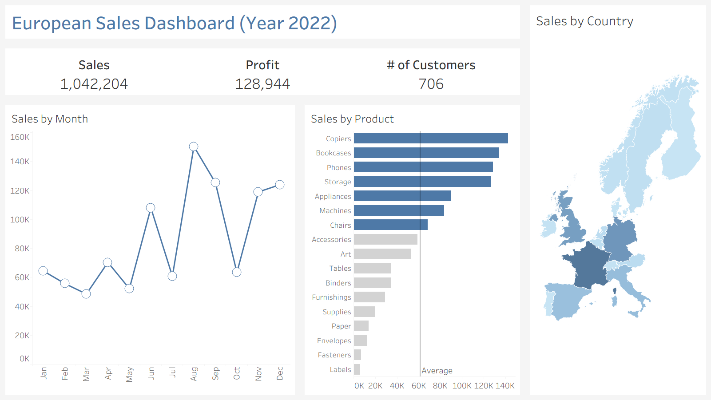

# 📊 Tableau Sales Dashboard

## Overview

This project demonstrates my foundational Tableau skills by creating an interactive sales dashboard using a retail sales dataset consisting of Orders and Returns tables.

The dashboard provides business insights into sales performance, profitability, product categories, regional performance, and returned orders.

---

## Dashboard Preview



---

## Objectives

- Import multiple datasets into Tableau
- Create relationships between tables
- Design interactive visualizations
- Build a business dashboard
- Generate meaningful insights

---

## Dataset

The project uses two datasets:

- Orders
- Returns

The datasets were cleaned before importing into Tableau.

---

## Dashboard Features

- Sales KPI
- Profit KPI
- Order Count
- Sales Trend
- Sales by Category
- Profit by Region
- Returns Analysis
- Interactive Filters

---

## Tools Used

- Tableau Desktop
- CSV Dataset
- GitHub

---

## Skills Demonstrated

- Data Cleaning
- Data Modeling
- Dashboard Design
- Interactive Filters
- Business Intelligence
- Data Visualization

---

## Repository Structure

```
tableau-sales-dashboard/
│
├── data/
├── tableau/
├── images/
├── docs/
└── README.md
```

---

## Future Improvements

- Customer Segmentation
- Forecasting
- Dynamic Parameters
- Drill-down Dashboard

---

## Author
Aasif Shaikh
